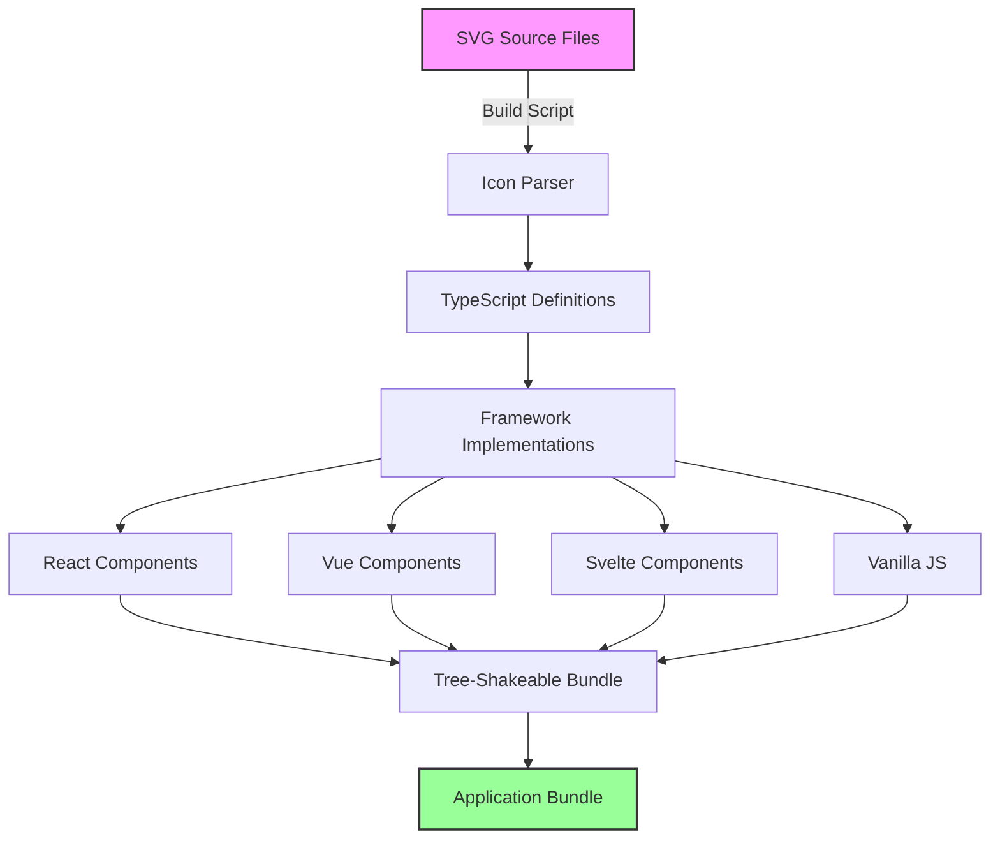
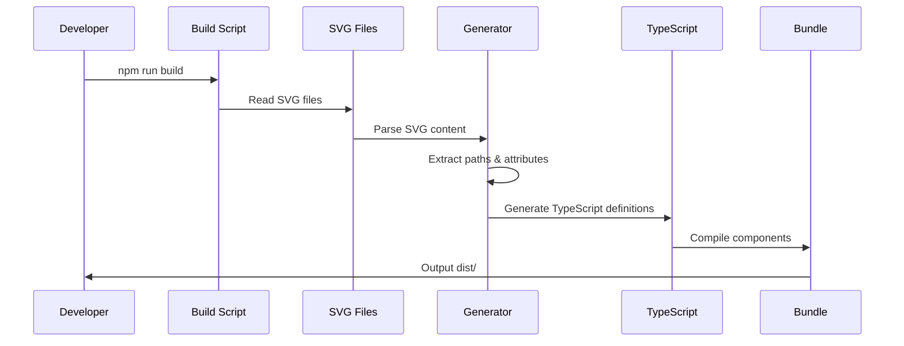
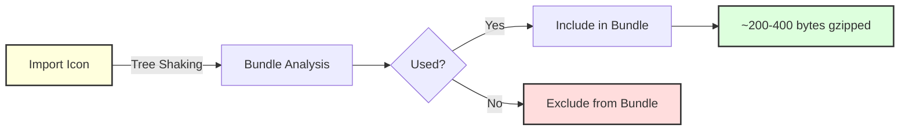
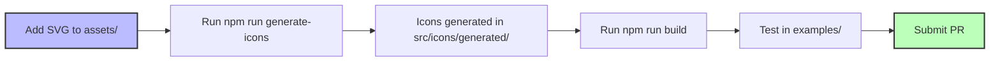

# Precast Icons

A comprehensive SVG icon library optimized for modern web applications. Provides framework-agnostic icons with tree-shaking support, TypeScript definitions, and zero runtime dependencies.

## Features

- **Framework Agnostic** - Native support for React, Vue, Svelte, and vanilla JavaScript
- **Optimized Bundle Size** - Tree-shakeable architecture ensures only imported icons are included
- **Full Customization** - Complete control over size, color, stroke width, and styling
- **Zero Dependencies** - No runtime dependencies for minimal overhead
- **TypeScript Ready** - Comprehensive type definitions for all components and utilities
- **Extensive Icon Set** - Over 4,000+ professionally designed icons available
- **Monochrome Support** - Toggle between stroke and fill rendering modes

## Architecture



## Installation

```bash
npm install @precast/icons
# or
yarn add @precast/icons
# or
pnpm add @precast/icons
```

## Usage

### React

```jsx
import { HomeIcon, SearchIcon, MenuIcon } from '@precast/icons/react';

function MyComponent() {
  return (
    <div>
      <HomeIcon size={24} color="blue" />
      <SearchIcon size={32} strokeWidth={1.5} />
      <MenuIcon className="custom-class" style={{ color: 'red' }} />
    </div>
  );
}
```

#### Using the Icon component with dynamic icons

```jsx
import { Icon } from '@precast/icons/react';
import { icons } from '@precast/icons';

function DynamicIcon({ iconName }) {
  return <Icon icon={icons[iconName]} size={24} />;
}
```

#### Creating custom icons

```jsx
import { createIcon } from '@precast/icons/react';

const CustomIcon = createIcon({
  name: 'custom',
  viewBox: '0 0 24 24',
  content: [
    {
      tag: 'path',
      attrs: {
        d: 'M12 2L2 7v10c0 5.55 3.84 10.74 9 12 5.16-1.26 9-6.45 9-12V7l-10-5z',
      },
    },
  ],
});

// Use it like any other icon
<CustomIcon size={24} color="green" />;
```

### Vue

```vue
<template>
  <div>
    <HomeIcon :size="24" color="blue" />
    <SearchIcon :size="32" :stroke-width="1.5" />
    <MenuIcon class="custom-class" />
  </div>
</template>

<script setup>
import { HomeIcon, SearchIcon, MenuIcon } from '@precast/icons/vue';
</script>
```

#### Creating custom Vue icons

```javascript
import { createIcon } from '@precast/icons/vue';

const CustomIcon = createIcon({
  name: 'custom',
  viewBox: '0 0 24 24',
  content: [
    {
      tag: 'path',
      attrs: {
        d: 'M12 2L2 7v10c0 5.55 3.84 10.74 9 12 5.16-1.26 9-6.45 9-12V7l-10-5z',
      },
    },
  ],
});
```

### Svelte

```svelte
<script>
  import { Icon, icons } from '@precast/icons/svelte';
</script>

<Icon icon={icons.home} size={24} color="blue" />
<Icon icon={icons.search} size={32} strokeWidth={1.5} />
<Icon icon={icons.menu} class="custom-class" />
```

### Vanilla JavaScript

```javascript
import { icons, renderIconDefinition } from '@precast/icons';

// Get SVG string
const svgString = renderIconDefinition(icons.home, {
  size: 24,
  color: 'blue',
  strokeWidth: 2,
});

// Insert into DOM
document.getElementById('icon-container').innerHTML = svgString;
```

## Icon Generation Process



## Available Icons

The library includes over 3,000 professionally designed icons covering various categories:

### Common Icons

- `home` - Home/house icon
- `search` - Magnifying glass
- `user` - User profile
- `menu` - Hamburger menu
- `heart` - Heart/favorite
- `star` - Star/rating
- `download` - Download arrow
- `upload` - Upload arrow
- `check` - Checkmark

### Navigation

- `chevronRight` - Right chevron arrow
- `chevronLeft` - Left chevron arrow
- `arrowUp` - Up arrow
- `arrowDown` - Down arrow

### Actions

- `plus` - Plus/add icon
- `minus` - Minus/subtract icon
- `edit` - Edit/pencil icon
- `trash` - Delete/trash icon

View the complete icon list in the [icons directory](./src/icons/generated/)

## Props

All icon components accept these props:

| Prop          | Type               | Default          | Description                     |
| ------------- | ------------------ | ---------------- | ------------------------------- |
| `size`        | `number \| string` | `24`             | Icon size (width and height)    |
| `color`       | `string`           | `'currentColor'` | Icon color                      |
| `strokeWidth` | `number \| string` | `2`              | Stroke width for the icon paths |
| `fill`        | `string`           | `'none'`         | Fill color                      |
| `stroke`      | `string`           | `'currentColor'` | Stroke color                    |
| `className`   | `string`           | `''`             | CSS class name                  |
| `style`       | `object`           | `{}`             | Inline styles                   |

## Advanced Usage

### Creating Icon Definitions

```javascript
import { createIconDefinition } from '@precast/icons';

const myIcon = createIconDefinition(
  'myIcon',
  ['M12 2L2 7v10c0 5.55 3.84 10.74 9 12'], // Array of path data
  { viewBox: '0 0 24 24' } // Optional overrides
);
```

### Custom Styling

Icons use `currentColor` by default, making them easy to style with CSS:

```css
.my-icon {
  color: #3b82f6;
  transition: color 0.2s;
}

.my-icon:hover {
  color: #2563eb;
}
```

## TypeScript Support

Full TypeScript support with exported types:

```typescript
import type { IconDefinition, IconProps } from '@precast/icons';
import { HomeIcon } from '@precast/icons/react';

const MyIcon: React.FC<IconProps> = (props) => {
  return <HomeIcon {...props} />;
};
```

## Performance Characteristics



### Bundle Size

The library leverages tree-shaking to ensure optimal bundle sizes:

| Import Type                 | Bundle Impact          |
| --------------------------- | ---------------------- |
| Single Icon                 | ~200-400 bytes gzipped |
| 10 Icons                    | ~2-4 KB gzipped        |
| 50 Icons                    | ~10-20 KB gzipped      |
| All Icons (not recommended) | ~650 KB gzipped        |

### Build Performance

- Icon generation: ~0.4s for 3,000+ icons
- TypeScript compilation: ~30s
- Zero runtime overhead

## Browser Support

| Browser | Version |
| ------- | ------- |
| Chrome  | 88+     |
| Firefox | 78+     |
| Safari  | 14+     |
| Edge    | 88+     |
| Opera   | 74+     |

Note: Legacy browser support (IE11) possible with appropriate polyfills.

## Development Workflow



### Adding New Icons

1. Place SVG files in `assets/` directory
2. Run `npm run generate-icons`
3. Build the library with `npm run build`
4. Test integration in example applications

### Contributing

Contributions are welcome. Please ensure:

1. SVG files are optimized (SVGO recommended)
2. Icons follow consistent 24x24 viewBox
3. Stroke-based designs preferred over fill
4. Tests pass with `npm test`
5. Examples work correctly

## License

MIT License - see LICENSE file for details

## Project Structure

```
precast-icons/
├── assets/              # Source SVG files
├── dist/                # Built library output
│   ├── react/          # React components
│   ├── vue/            # Vue components
│   ├── svelte/         # Svelte components
│   └── icons/          # Core icon definitions
├── examples/            # Framework examples
│   ├── react-example.tsx
│   ├── vue-example.vue
│   ├── svelte-example.svelte
│   └── html-example.html
├── scripts/             # Build scripts
│   └── build-icons.js  # Icon generation script
└── src/                 # Source code
    ├── icons/          # Icon definitions
    ├── react/          # React implementation
    ├── vue/            # Vue implementation
    └── svelte/         # Svelte implementation
```

## Icon Manifest & AI Schema

For AI tools and documentation purposes, we provide a comprehensive manifest:

- **Manifest**: `/dist/manifest.json` - Complete icon catalog with usage examples
- **JSON Schema**: `/dist/schema.json` - Machine-readable schema for AI tools

```bash
# Access the manifest
curl https://unpkg.com/@precast/icons@latest/dist/manifest.json

# Use in AI tools or documentation generators
fetch('@precast/icons/dist/manifest.json')
  .then(res => res.json())
  .then(manifest => {
    console.log(`${manifest.totalIcons} icons available`);
    console.log('Categories:', manifest.categories);
  });
```

## Disclaimer

⚠️ **Icon Removal Policy**: If any companies want their icons removed from this library, please reach out to **support@buungroup.com**. We respect intellectual property rights and will promptly address any concerns.

## Acknowledgments

Inspired by modern icon libraries with focus on performance and developer experience.
